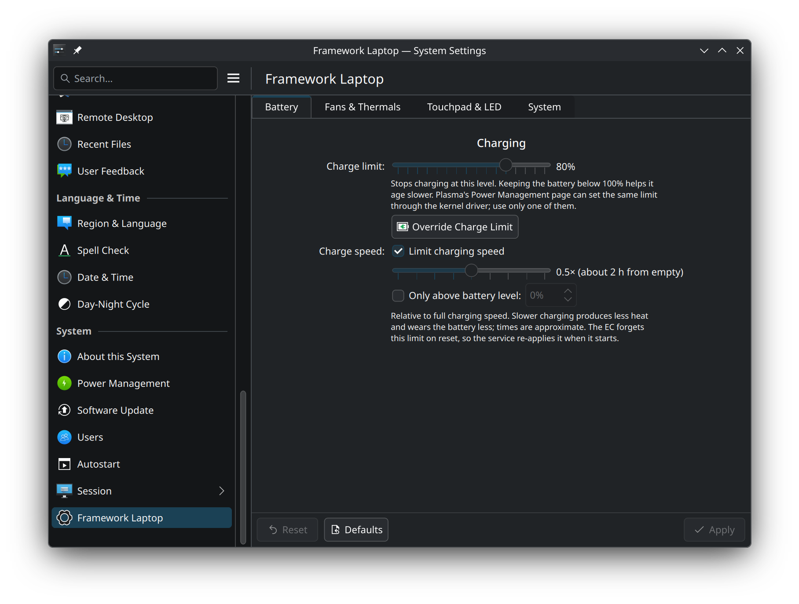
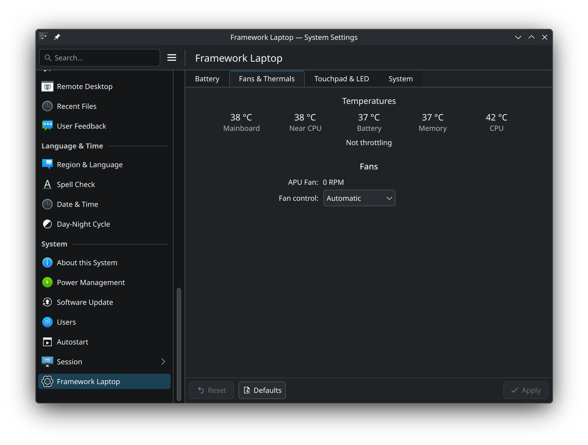
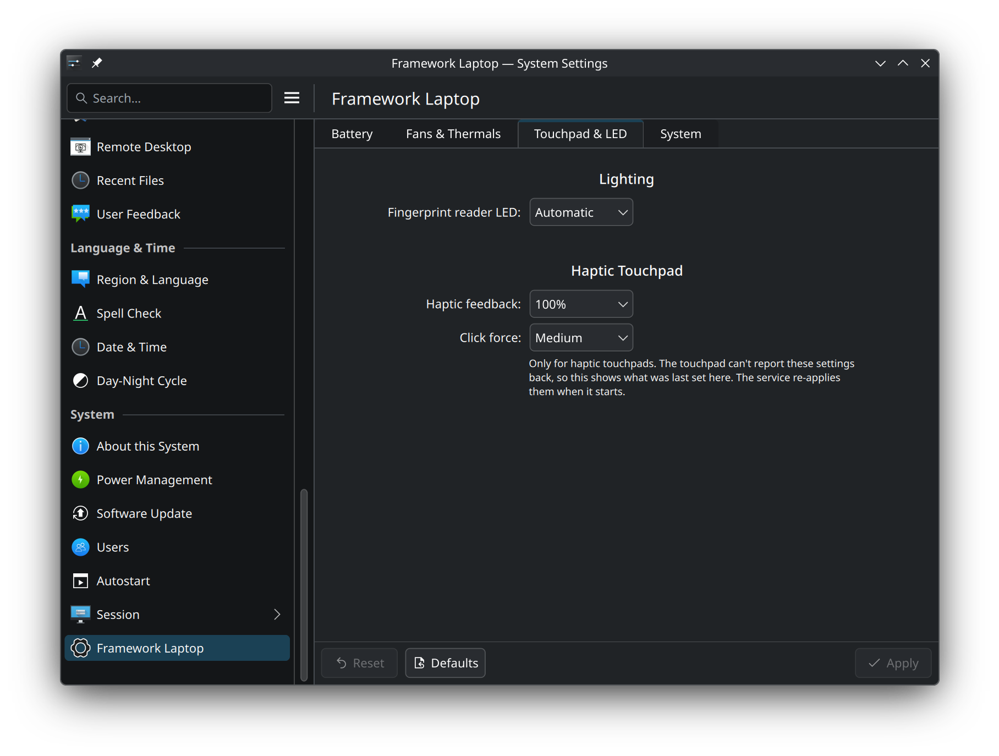
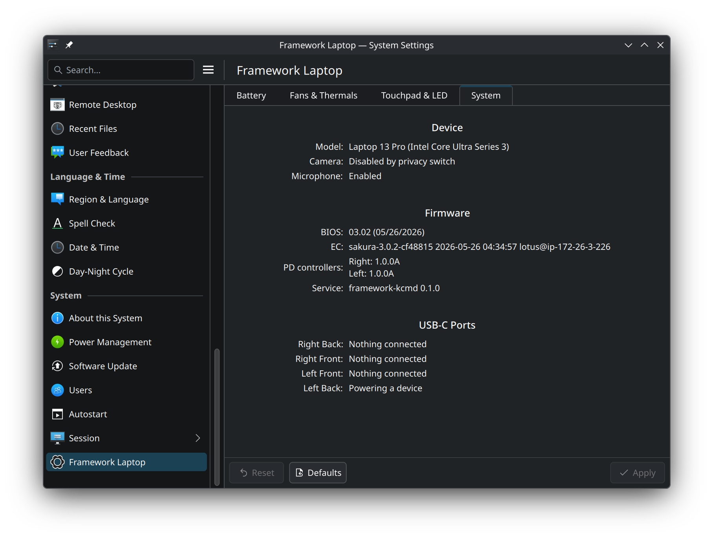

# Framework KCM

| Battery | Fans & Thermals |
|---|---|
|  |  |
| **Touchpad & LED** | **System** |
|  |  |

A KDE System Settings module for Framework laptops, built on
[`framework_lib`](https://github.com/FrameworkComputer/framework-system).
Developed against the Laptop 13 Pro (Intel Core Ultra Series 3).

- **Battery**: charge limit (temporary, see below), one-time override to 100%, and charge rate limit
- **Fans & Thermals**: temperatures, fan RPM, throttling, manual/automatic fan control
- **Touchpad & LED**: fingerprint LED, haptic touchpad intensity and click force
- **System**: model, BIOS/EC/PD firmware versions, privacy switches, USB-C port state

## How it fits together

```
System Settings ──D-Bus (system bus)──▶ framework-kcmd (root) ──framework_lib──▶ EC / HID / SMBIOS
  kcm_framework (C++/QML)                   polkit checks on writes
```

Talking to the EC needs root, and a KCM runs as your user, so the hardware
access lives in `daemon/`. That's a small Rust service that links
`framework_lib` directly and serves `io.github.frameworkkcm.Daemon1` on the
system bus. Anyone can read. Writes go through polkit:

| Action                             | Default for the active local user          |
|------------------------------------|--------------------------------------------|
| `io.github.frameworkkcm.battery`   | allowed                                    |
| `io.github.frameworkkcm.fan`       | admin password, remembered for the session |
| `io.github.frameworkkcm.input`     | allowed (touchpad, fingerprint LED)        |

Some settings can't be read back from the hardware: touchpad haptics, click
force and the charge rate limit. The daemon saves these to
`/var/lib/framework-kcmd/state.json` and re-applies them when it starts.
If you set the fans to a fixed speed, they go back to automatic when the
daemon exits.

**Override Charge Limit** raises the limit to 100% until the next boot. The
daemon records the old limit together with the kernel's boot ID. When it
starts in a new boot, it puts the old limit back. Restarting the daemon
within the same boot keeps the override. Choosing a new charge limit, or
pressing *Restore Now*, ends it early.

## Build & install

Requirements: Rust (cargo), CMake, ECM, Qt 6, KF6 (KCMUtils, I18n, CoreAddons), Kirigami, and hidapi/libudev.

With Docker (no Rust toolchain needed on the host):

```sh
./build.sh                          # extra args go to cmake, e.g. ./build.sh -DBUILD_DAEMON=OFF
sudo cmake --install build
```

Or natively:

```sh
sudo pacman -S --needed rust cmake extra-cmake-modules kcmutils ki18n kirigami hidapi

cmake -B build -DCMAKE_INSTALL_PREFIX=/usr
cmake --build build
sudo cmake --install build
```

Then, either way:

```sh
sudo systemctl daemon-reload
sudo systemctl reload dbus          # pick up the new bus policy
sudo systemctl enable --now framework-kcmd

kcmshell6 kcm_framework             # or System Settings → System → Framework Laptop
```

To build only the KCM (for example, to iterate on the QML): `-DBUILD_DAEMON=OFF`.

## Packages & releases

GitHub Actions (`.github/workflows/build.yml`) builds everything on every push
and pull request. Pushing a `v*` tag also builds packages and attaches them
to a GitHub release:

| Distribution | Package | Built with |
|---|---|---|
| Arch Linux | `framework-kcm-<version>-1-x86_64.pkg.tar.zst` | `packaging/arch/PKGBUILD` and `makepkg` |
| Ubuntu 26.04 | `framework-kcm_<version>_amd64.deb` | CPack (`packaging/cpack.cmake`) |

```sh
sudo pacman -U framework-kcm-*.pkg.tar.zst   # Arch; then: sudo systemctl enable --now framework-kcmd
sudo apt install ./framework-kcm_*.deb       # Ubuntu; enables and starts the service
```

To release, bump the version in `CMakeLists.txt` (`project(... VERSION ...)`)
and `daemon/Cargo.toml`, commit, then tag it:

```sh
git tag v0.2.0 && git push origin v0.2.0
```

The workflow refuses to package a tag that doesn't match both versions.

## Poking the daemon directly

```sh
busctl introspect io.github.frameworkkcm.Daemon1 /io/github/frameworkkcm/Daemon1
busctl call io.github.frameworkkcm.Daemon1 /io/github/frameworkkcm/Daemon1 \
    io.github.frameworkkcm.Daemon1 GetPower
busctl call io.github.frameworkkcm.Daemon1 /io/github/frameworkkcm/Daemon1 \
    io.github.frameworkkcm.Daemon1 SetChargeLimit i 80
journalctl -u framework-kcmd
```

Run it in the foreground with more logging:
`sudo RUST_LOG=debug build/cargo/release/framework-kcmd` (stop the service first).

## Translations

The KCM follows the language set in System Settings. It ships Dutch,
German, Spanish and French translations (`po/<lang>/kcm_framework.po`),
which are **machine translations that still need review by native
speakers**. The System Settings entry and the polkit password prompts are
translated too, in `kcm/kcm_framework.json` and
`data/io.github.frameworkkcm.policy`.

The daemon sends no display text, only stable keys such as
`"location": "near-cpu"` or `"role": "sink-not-charging"`, and the QML turns
them into translated strings. A root system service can't know the user's
language.

After changing strings in the KCM, refresh the template and merge it into
every language:

```sh
po/update.sh        # needs gettext
```

To add a language, copy `po/kcm_framework.pot` to `po/<lang>/kcm_framework.po`
and translate it. `ki18n_install` picks it up on the next build.

## Things to know

- **The charge limit slider is temporary.** Plasma's Power Management page
  doesn't expose the Framework 13 Pro charge limit correctly yet, so this
  module provides one for now. Once Plasma does, the slider will be removed
  from here. Until then, both write the same EC setting, so set the limit in
  only one place.
- Haptic and click force settings only apply to the haptic touchpads found
  on the 13 Pro Input Cover.
- Keyboard backlight is left to Plasma, which drives it through `cros_kbd_led_backlight`.
- USB-C port names follow `framework_tool --pdports`.
